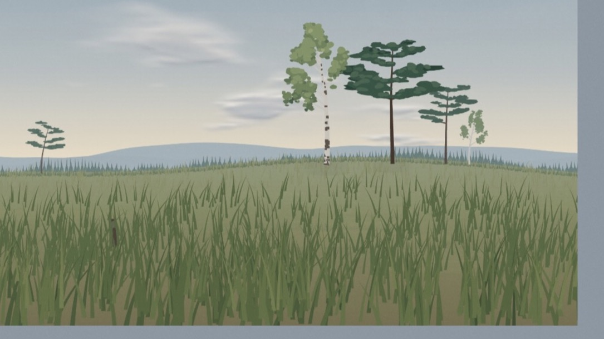
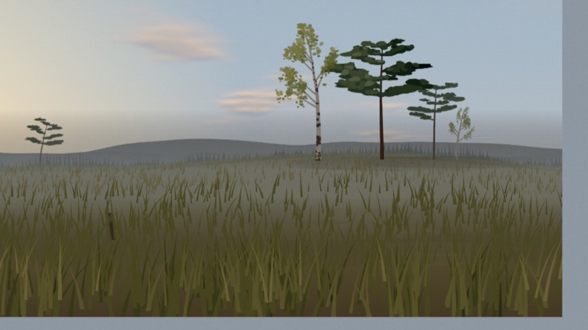
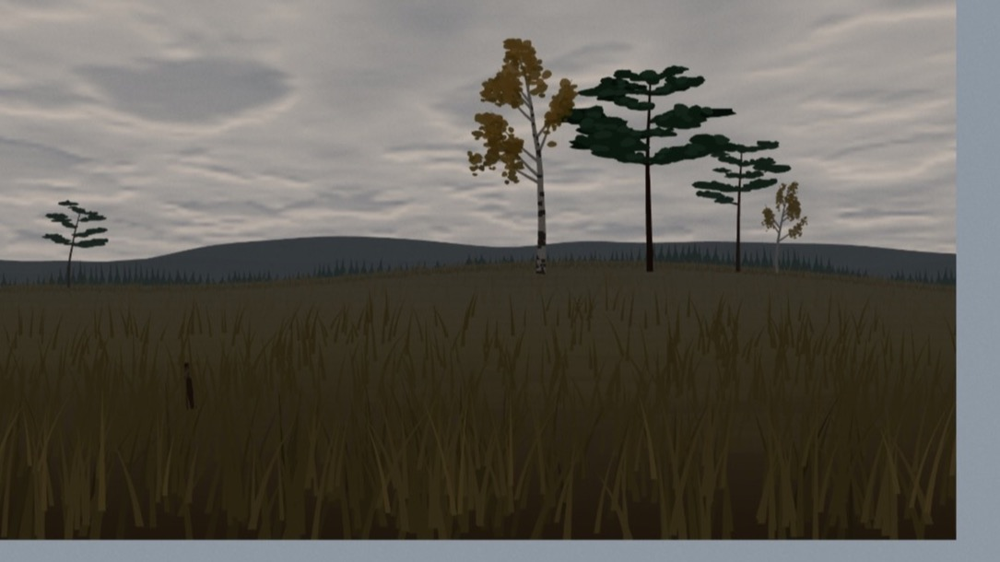
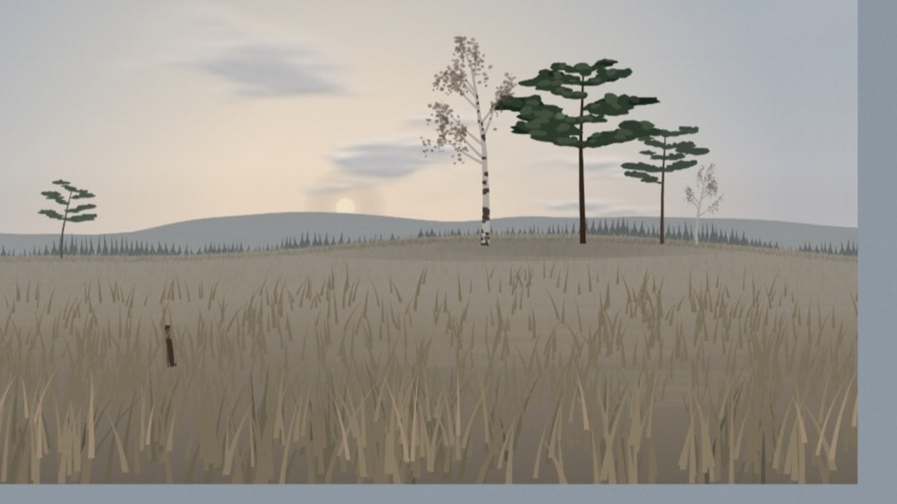

# Yonder

A living illustration of one Scandinavian meadow, drawn in real time from live weather.
Not a weather app — a view of somewhere else. See `yonder-agent-brief.md` for the full brief.

Live: https://bayhill.github.io/Yonder/

| | |
|---|---|
|  |  |
|  |  |

Default place is Norrtälje. Click the place name for another (or "here"). The temperature sits top right, always. Move the pointer for the
timeline; drag to go up to 48 hours ahead, ←/→ step an hour, Escape returns to now. It installs as a
full-screen web app on a phone.

## Develop

```
npm install
npm run dev      # http://localhost:5173/Yonder/
npm test         # vitest
npm run build    # typecheck + static build into dist/
```

In dev a control panel (toggle with `` ` ``; the state is remembered, `?panel=0|1` overrides) exposes time, time-lapse speed, cloud, fog, wind, rain, snow, humidity
and temperature; every change is mirrored into the URL. Parameters: `?hour=13.5&doy=200&time=ISO&cloud=0.5&fog=0.1`
`&wind=8&gust=12&dir=240&rain=2&snow=1.5&temp=-3&hum=0.95`, `?lat=&lon=&name=` place, `?vp=420x840` fixed viewport,
`?skip=grass,trees` hides layers. Any weather parameter switches the scene from live data to the sliders.
`S` saves a PNG, `[` `]` ±1 h, `{` `}` ±1 day, `0` back to now.

## Structure

```
src/core       loop (fixed timestep), seeded rng, smoothing (no overshoot), easing, reduced-motion scale
src/colour     OKLCH palettes per season → season blend → light model → resolved per-frame colours
src/scene      composition (1600×900 world, cover-crop anchored on the main tree), procgen, layers
src/render     canvas renderer; static back layers cached offscreen, grain as a DOM overlay
src/astronomy  sun/moon              src/wind     wind field, gusts
src/weather    controls → smoothing → accumulation (snow cover, wet ground) → track; inferred dawn mist
src/data       Open-Meteo forecast + geocoding, cache, store (30-min refresh, last good state kept)
src/ui         overlay fade, corner label + picker, timeline, browser chrome (theme colour, favicon)
scripts/       icons.mjs renders the PWA icons
```

## Scene notes

Layers, back to front: sky · stars · moon · sun · clouds · lightning · rainbow · rays · far hills · birds · far treeline ·
shimmer · ground · far snow · far trees · far snowfall · fog · back grass · near trees · leaves · post · mid grass ·
flowers · near snow · front grass · cloud shadows · near snowfall · rain. Static layers are cached offscreen and redrawn only when colours move a notch. The sky is computed per texel
(128×64, upscaled): horizon brightening, warmth around the sun's azimuth, and at twilight the Belt of Venus over the
Earth's shadow on the anti-solar side. Cloud shadows reuse the cloud density buffer, flipped onto the meadow. The
rainbow is placed at 42°/51° around the anti-solar point and only appears with rain under a low sun. Thunderstorm
codes (WMO 95+) give slow sheet lightning in the deck. Grass blades carry a second, faster spring at mid-height so
gusts whip them through an S-curve; each tree canopy swings on six branch oscillators rather than one. Clouds are
a noise field rebuilt at 20 Hz. A few times an hour, in daylight and fair weather, a line of distant birds crosses.
The sun is drawn only when it is low and veiled. Seasonal life is driven by continuous scalars in `colour/season.ts`:
leaf-out, midsummer wildflowers (`flowers`), the October leaf fall (`leaves`), and grass height; hoarfrost and dawn
mist are inferred from temperature, humidity, wind, cloud and sun (`weather/frost.ts`, `weather/mist.ts`). Blades
bent hard by a gust lift one tone, so wind crosses the field as a pale wave. `prefers-reduced-motion` scales all
motion to about a third. In dev, `window.__yonder.step(n)` advances the whole scene n steps when rAF is paused.

Deploys to GitHub Pages from `main` via `.github/workflows/deploy.yml`.
